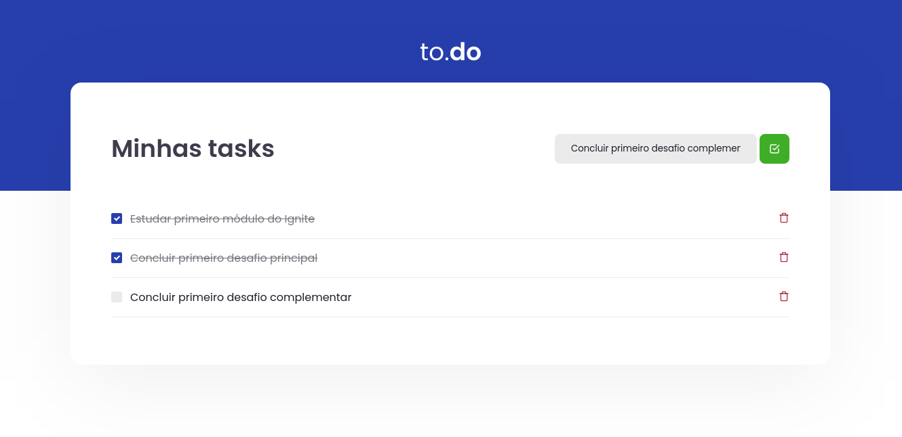

<h1 align="center">
    Bootcamp Ignite <br/>
    Desafio: Conceitos do React
</h1>

<p align="center">	
  
	
  <a href="https://www.linkedin.com/in/jonathanpauluze/">
    
  </a>
  
  <a href="https://github.com/jonathanpauluze/trustly-store/commits/main">
    
  </a>

</p>
<p align="center">
  <a href="#information_source-Sobre-o-desafio">Sobre</a>&nbsp;&nbsp;&nbsp;|&nbsp;&nbsp;&nbsp;
  <a href="#rocket-tecnologias-e-ferramentas">Tecnologias</a>&nbsp;&nbsp;&nbsp;|&nbsp;&nbsp;&nbsp;
  <a href="#wrench-como-rodar-o-projeto">Como rodar o projeto</a>
</p>

## :information_source: Sobre o desafio

Nesse desafio criei uma aplicação para treinar os conceitos aprendidos no módulo de fundamentos.



Esta é uma pequena aplicação de to-do list para treinar um pouco mais sobre manipulação do estado no React. Na aplicação é possível:
- Adicionar uma nova tarefa
- Remover uma tarefa
- Marcar e desmarcar uma tarefa como concluída

## :rocket: Tecnologias e Ferramentas
- [React](https://reactjs.org)

## :wrench: Como rodar o projeto

É necessário ter instalado:
- [Git](https://git-scm.com)
- [Node.js](https://nodejs.org/)
- [Yarn](https://yarnpkg.com/)

### Faça um clone do projeto

```bash
$ git clone https://github.com/jonathanpauluze/react-todo

# ou com a CLI do GitHub
$ gh repo clone jonathanpauluze/react-todo
```

### Instale as dependências
```bash
## Acesse o diretório do projeto
$ cd react-todo

# Instale as dependências
$ yarn

# Inicie o servidor de desenvolvimento
$ yarn dev
```

### Teste a aplicação
Para rodar os testes (utilizados na correção do desafio) execute o comando
```bash
yarn test
```


Feito com ♥ por Jonathan Pauluze
